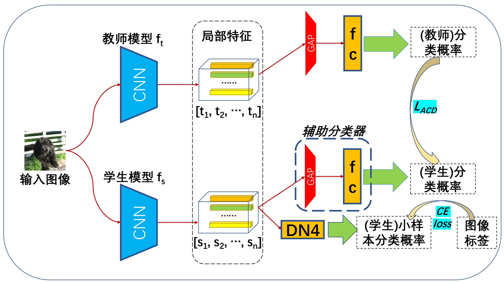
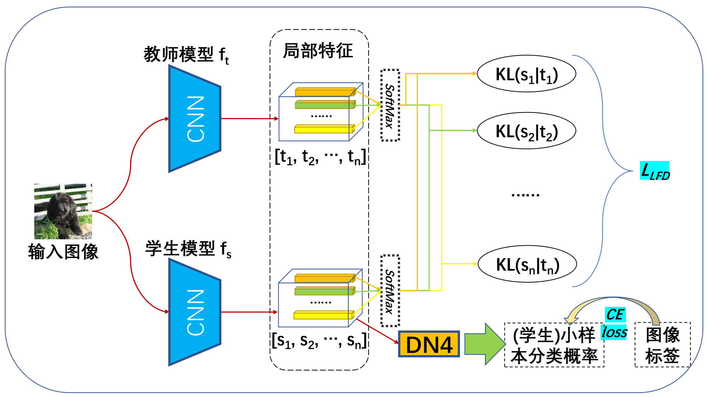

# FSLKD
Knowledge Distillation for Few-shot Learning

本项目为“软件学报 2023”文章《面向小样本学习的轻量化知识蒸馏》（待发表）的开源代码。

***
## 内容简介

本工作包含了2种面向小样本学习的知识蒸馏方法：

1、基于辅助分类器的蒸馏（Auxiliary Classifier Distillation, ACD）

2、基于图像局部特征的蒸馏（Local Feature Distillation, LFD）

***
## 代码结构

    FSLKD/
        checkpoints/        存放预训练权重及训练后模型
        Distill_module/     知识蒸馏及轻量化相关
        dataloader/         数据加载相关
        model/              模型定义相关
        trainer/            模型训练相关
        util/               多用途函数定义
        README.md           项目说明
        finetune.py         程序入口文件
        run_finetune.sh     程序配置脚本

***
## 使用说明

在run_finetune.sh脚本文件中，指定相关运行配置。

$ 执行指令，启动小样本蒸馏任务：

    sh run_finetune.sh

部分超参数简介：

- 'classifier': 小样本度量分类器。
- 'backbone': 特征提取网络。
- 'init_weights': 预训练权重路径。
- 'dataset': 数据集。
- 'dataset_path': 数据集路径。
- 'lr': 初始学习率。
- 'lr_scheduler': 学习率调整策略。默认为cosine衰减。
- 'gpu': 使用GPU运行时的设备号。
- 'is_prune': 是否对学生模型进行通道剪枝。
- 'remove_ratio': 通道剪枝比例。
- 'is_distill': 是否使用知识蒸馏。
- 'teacher_backbone_class': 教师模型特征提取网络。
- 'teacher_init_weights': 教师模型预训练权重路径。
- 'kd_loss': 蒸馏损失类型。
- 'kd_weight': 蒸馏损失权重。

***
## 运行结果

（MiniImageNet数据集小样本蒸馏结果）
| 蒸馏方法       |蒸馏损失权重 |测试集精度 5way-1shot   |
|:--:             |:--:     |:--:      |
|无 | -- | 56.15% | 74.67% |
|KD | 0.05 | 60.31% | 77.93% |
|LFD(ours) | 0.5 | 63.84% | 79.49% |
|ACD(ours) | 2.0 | 64.85% | 80.45% |

 

（TieredImageNet数据集小样本蒸馏结果）
| 蒸馏方法       |蒸馏损失权重 |测试集精度 5way-1shot   |
|:--:             |:--:     |:--:      |
|无 | -- | 56.46% | 75.72% |
|KD | 0.05 | 59.59% | 78.24% |
|LFD(ours) | 0.5 | 62.99% | 78.71% |
|ACD(ours) | 2.0 | 63.38% | 79.31% |

